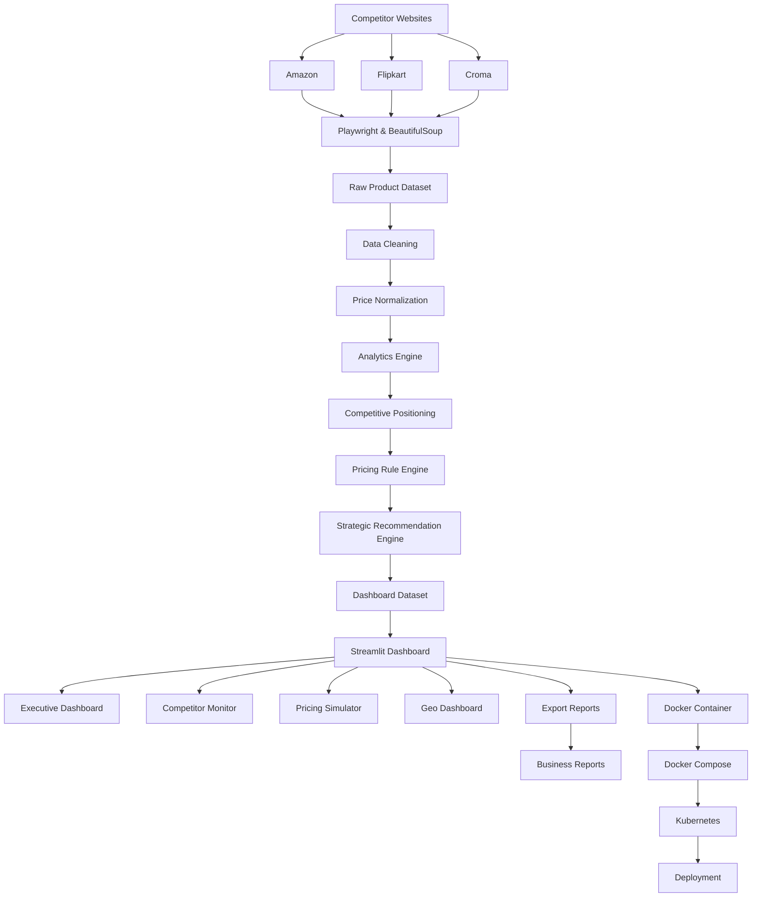

# Competitive Intelligence & Pricing Strategy Engine

```mermaid
flowchart TD

A[Competitor Websites]

A --> B1[Amazon]
A --> B2[Flipkart]
A --> B3[Croma]

B1 --> C[Playwright & BeautifulSoup]
B2 --> C
B3 --> C

C --> D[Raw Product Dataset]

D --> E[Data Cleaning]

E --> F[Price Normalization]

F --> G[Analytics Engine]

G --> H[Competitive Positioning]

H --> I[Pricing Rule Engine]

I --> J[Strategic Recommendation Engine]

J --> K[Dashboard Dataset]

K --> L[Streamlit Dashboard]

L --> M[Executive Dashboard]

L --> N[Competitor Monitor]

L --> O[Pricing Simulator]

L --> P[Geo Dashboard]

L --> Q[Export Reports]

Q --> R[Business Reports]

L --> S[Docker Container]

S --> T[Docker Compose]

T --> U[Kubernetes]

U --> V[Deployment]
```